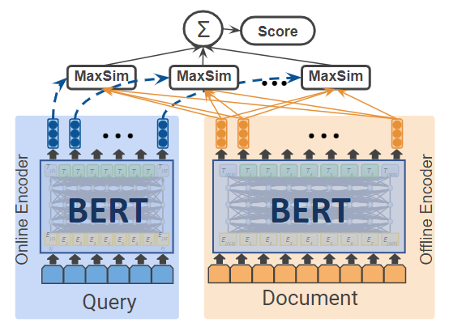
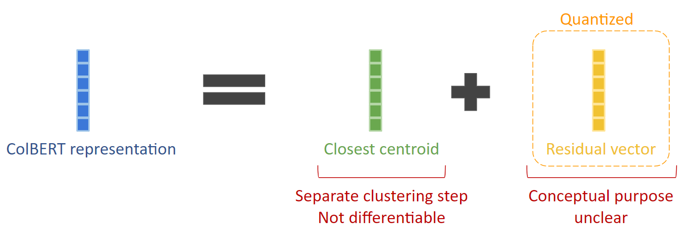
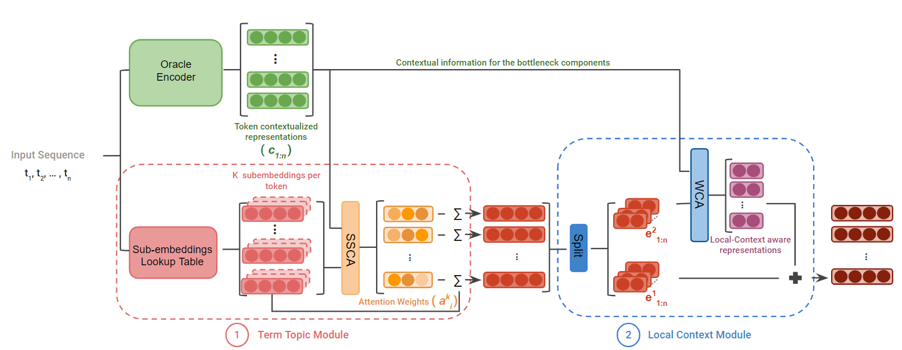
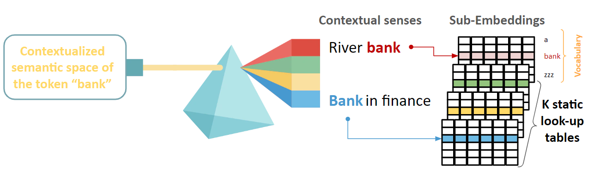
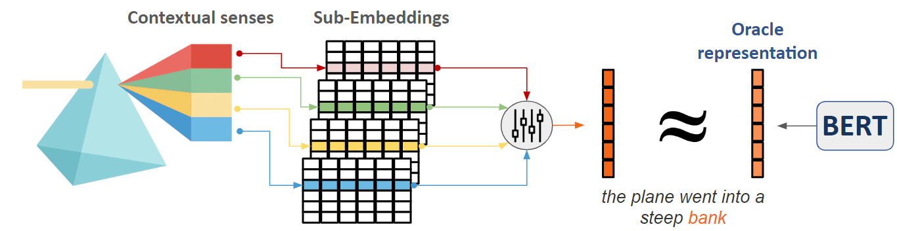

# Term-Topic-Embeddings
This repository contains the code for pre-training and fine-tuning the analysis framework of ColBERT's contextualized representations through term-topic embeddings and local contextualization approximations proposed in:

[A Study of Term-Topic Embeddings for Ranking]()

## Summary
Contextualized representations from transformer models have significantly improved the performance of neural ranking models. Late interactions introduced in [ColBERT](https://dl.acm.org/doi/10.1145/3397271.3401075) and recently compressed with clustering in [ColBERTv2](https://arxiv.org/abs/2112.01488) deliver state-of-the-art quality on many benchmarks. ColBERTv2 uses centroids along with occurrence-specific delta vectors to approximate the contextualized embeddings without reducing ranking effectiveness. Analysis of this work suggests that these centroids are ``term-topic embeddings''. We examine whether term-topic embeddings can be created in a differentiable end-to-end way, finding that this is a viable strategy for removing the separate clustering step. We investigate the importance of local context for contextualizing these term-topic embeddings, analogous to refining centroids with delta vectors. We find this end-to-end approach is sufficient for matching the effectiveness of the original contextualized embeddings.

## Background
* ColBERT uses a BERT encoder to encode each query and each document into their token-level contextualized representations which are then used to predict the relevance score using all-to-all soft semantic matching between the query and document token vectors. All token representations need to be indexed which imposes a large storage footprint.



* ColBERTv2 proposes a residual vector compression mechanism to reduce the index size of ColBERT by using k-means clustering along with residual vector quantization.
  1. Use k-means to identify topic clusters in the semantic space produced by ColBERT (all the token contextualized representations for a collection);
  2. Given the original token contextualized vector produced by ColBERT, find the closest cluster centroid;
  3. Compute the residual vector between the original ColBERT token vector and the closest centroid vector and quantize it.
  
  
 
## Framework 
Try to approximate the contextualized representations produced by ColBERT's encoder (the Oracle model) with a more principled approach based on term-topic embeddings learned in and end-to-end way using the Term Topic Module along with minor refinements using local contextualization in the Local Context Module. 



### Term Topic Module (TTM)
1. Automatically leran a finite small set of static sub-embeddings which decompose the semantic space of a token into its **contextual senses** or **topics**.

  

2. Combine a token's sub-embeddings with different weights to produce occurrence-specific representations which approximate the original ColBRET contextualized representation (distillation method).

  
  
### Local Context Module (LCM)
Refine the term-topic embeddings using a local window attention mechanism to incorporate fine-grained information from the imediate context.

# Code
## Dependencies
This code has been tested in the following environement:
```
torch==1.9.0 
transformers>=4.9.1, <=4.9.2 
einops==0.3
```
## Resources
[](https://huggingface.co/)
[](https://huggingface.co/)
[](https://huggingface.co/)

* __Oracle:__ We use the distilbert encoder from a fine-tuned [ColBERT](https://huggingface.co/sebastian-hofstaetter/colbert-distilbert-margin_mse-T2-msmarco) model for ranking on Ms Marco. 
* __CAR passages:__ We extract passages from the TREC CAR collection using a sliding window of 128 with a stride of 96

## Minimal usage example
Colab notebook [](notebook.ipynb)

## Reproduction scripts
We provide .ssh scripts to train our modules from scratch under the train folder with the same hyper-parameters used in the ECIR'23 paper.

## Citation
If you find our work helpful, please cite it as:
```
```
